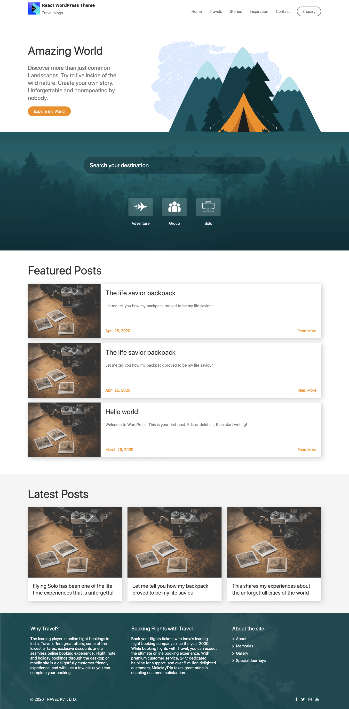
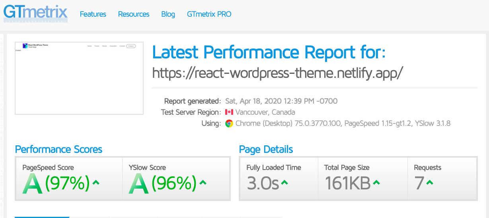
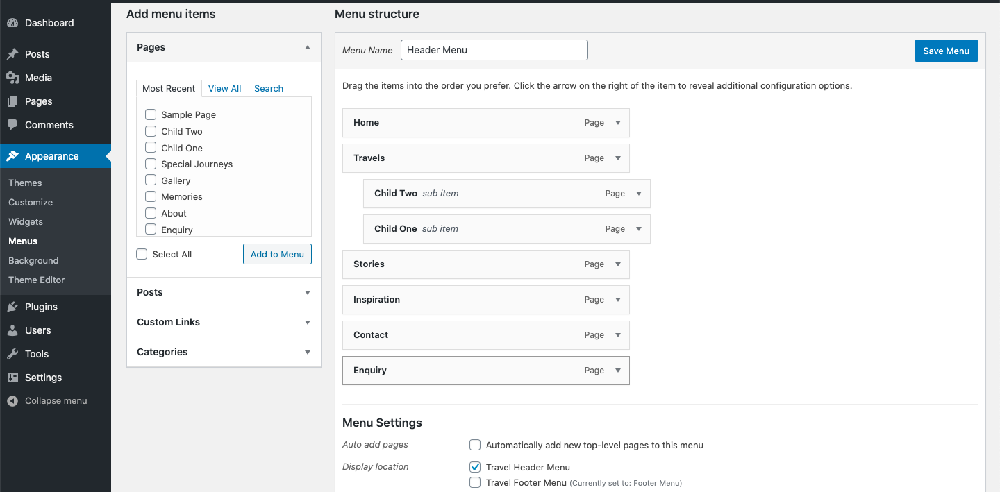
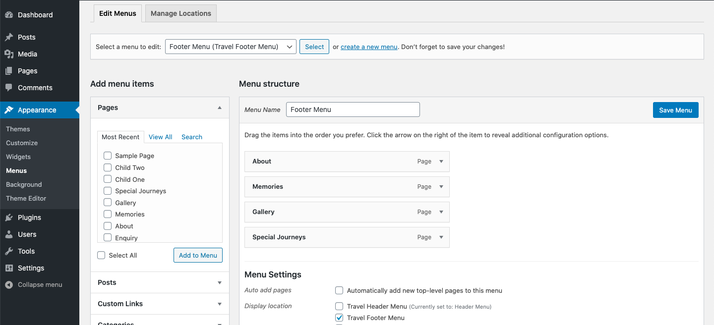

# React WordPress Theme 🎨
[](https://www.repostatus.org/#wip) [](https://github.com/prettier/prettier)

A React theme for WordPress, using Decoupled Architecture.
Front end in React.
Backend in WordPress.

## Live Demo
[Live Demo](https://react-wordpress-theme.netlify.app/)



## Performance


## Maintainer

| Name                                                   | Github Username |
|--------------------------------------------------------|-----------------|
| [Imran Sayed](mailto:codeytek.academy@gmail.com)       |  @imranhsayed   |

## Usage

1. Clone the WordPress plugin [Headless CMS](https://github.com/imranhsayed/headless-cms) in your WordPress
plugin directory and activate it.

2. The REST API endpoints, registers custom endpoints and also registers two menus. So please create two menus
`Header Menu` and `Footer Menu` and select their respective menu location as `HCMS Header Menu` and `HCMS Footer Menu`
as shown in the picture.

- Set Header menu as `Travel Header Menu`



- Set Footer menu as `Travel Footer Menu`


3. Set the siteURL and other settings in `client-config.js`.

```javascript
const config = {
	siteURL: 'xxxxxx', // e.g. 'https://wordpressSite.com' 
	headerMenuLocation: 'hcms-menu-header', // Change this menu location name to another, if you would like a different menu to be used for header. 
	footerMenuLocation: 'hcms-menu-footer', // Change this menu location name to another, if you would like a different menu to be used for footer.
	siteTitle: 'React WordPress Theme', // Will be used if we don't set site title from WordPress customizer.
	siteDescription: 'Awesome theme', // Will be used if we don't set site description from WordPress customizer.
};
```

More settings can be found in `client-config.js`

## Development

**Install**

Clone the repo and run

```bash
npm install
```

**During development**

Starts webpack dev server at `localhost:8080`

```bash
npm run dev
```

**Production**

Creates an `index.html` and JavaScript file in `build` directory.

```bash
npm run prod
```

**Client Config**
Put your site URL name in the `client-config.js`;
const siteUrl = 'https://yourWordPressSite.com';

**Linting & Formatting**

The following command will fix most errors and show and remaining ones which cannot be fixed automatically.

```bash
npm run eslint:fix
```

We follow the stylelint configuration used in WordPress Gutenberg, run the following command to lint and fix styles.

```bash
npm run stylelint:fix
```

Format code with prettier

```bash
npm run format-js
```

Run test

```bash
npm run test
```

Update test

```bash
npm run test:update
```

**precommit**

You should run precommit to check for any eslint, stylint errors/warnings and to ensure all tests are passing before making a PR ready for review.

```bash
npm run precommit
```
